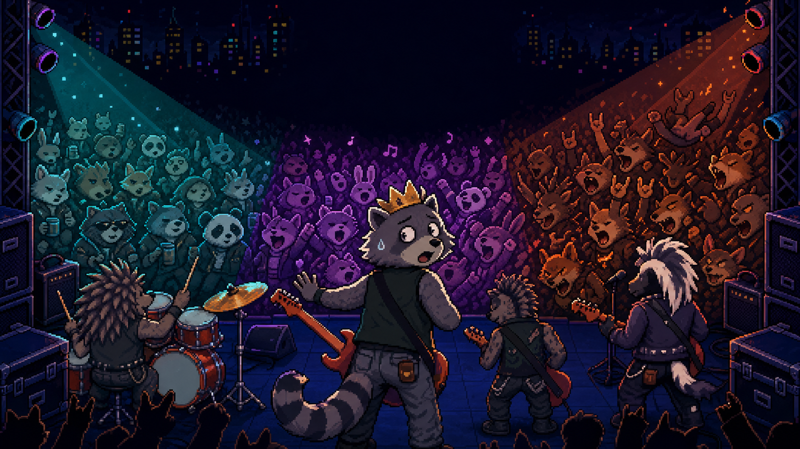

# Raccoon Roll

  

  <strong>관객의 취향을 읽고, 지금 무대에 가장 필요한 애드리브를 선택하라!</strong>

## 게임 소개

**Raccoon Roll**은 너구리 밴드의 메인 락커가 되어 관객의 복장과 움직임, 현재 몰입도와 무대의 분위기를 읽고 적절한 애드리브 카드를 선택하는 픽셀 아트 전략 카드 게임입니다.

좋은 애드리브가 따로 정해져 있는 것은 아닙니다. 같은 카드도 관객의 성향과 현재 상태에 따라 전혀 다른 반응과 점수를 만들어냅니다.

관객이 모두 떠나기 전에 공연의 열기를 끌어올리고, 제한 시간 안에 목표 점수를 달성해 최고의 랭크에 도전하세요!

## 지금 플레이하기

> ### [▶ itch.io에서 Raccoon Roll 플레이하기](https://probablymayb.itch.io/raccoonroll)
>
> 별도의 설치 없이 웹 브라우저에서 바로 플레이할 수 있습니다. 
> 쾌적한 플레이를 위해 전체화면 모드를 권장합니다.

## 핵심 특징

- **맥락을 읽는 카드 전략** 
  관객의 옷차림과 움직임, 무대 조명을 관찰하고 지금 가장 효과적인 애드리브를 선택하세요.

- **서로 다른 관객 반응** 
  관객은 Chill, Sing Along, Mosh의 세 가지 성향과 Calm, Middle, Excited의 몰입 상태를 가집니다. 같은 카드라도 관객마다 다른 반응을 보입니다.

- **실시간 관객 관리** 
  관객의 몰입도는 시간이 지나면서 감소합니다. 적절한 카드로 관심을 되찾지 못하면 관객이 공연장을 떠나며, 모든 관객이 퇴장하면 공연이 끝납니다.

- **드로우와 리롤** 
  원하는 카드가 없다면 드로우와 리롤 카드를 사용해 손패를 정비하고 다음 선택을 준비하세요.

- **콤보와 피버 타임** 
  성공적인 선택을 연속으로 이어가면 콤보 배율이 상승합니다. 5콤보마다 피버 타임이 발동하며, 짧은 시간 동안 안정적으로 높은 점수를 획득할 수 있습니다.

- **스페셜 관객 저격** 
  공연 도중 특별한 요구를 가진 관객이 등장합니다. 알맞은 스페셜 카드를 관객에게 직접 전달해 강력한 추가 효과를 획득하세요.

- **랭크와 리더보드** 
  공연 결과는 F부터 S까지의 랭크로 평가됩니다. 자신의 이름과 점수를 기록하고 더 높은 순위에 도전할 수 있습니다.

## 플레이 방법

1. 관객의 복장과 움직임을 관찰해 각자의 성향과 현재 상태를 파악합니다.
2. 손에 있는 애드리브 카드와 유틸리티 카드를 확인합니다.
3. 사용할 카드를 위로 드래그해 공연합니다.
4. 스페셜 관객이 등장하면 요구에 맞는 카드를 해당 관객에게 직접 드래그합니다.
5. 관객의 몰입도를 유지하면서 콤보와 피버 타임을 활용합니다.
6. 제한 시간 안에 목표 점수를 달성하고 최고의 랭크에 도전합니다.

## 조작법

| 입력 | 동작 |
|---|---|
| 마우스 | UI 선택 및 카드 드래그 |
| `ESC` | 일시정지 |

## 개발 환경

- Unity `6000.3.20f1`
- C#
- Universal Render Pipeline 2D
- Unity Input System
- WebGL
